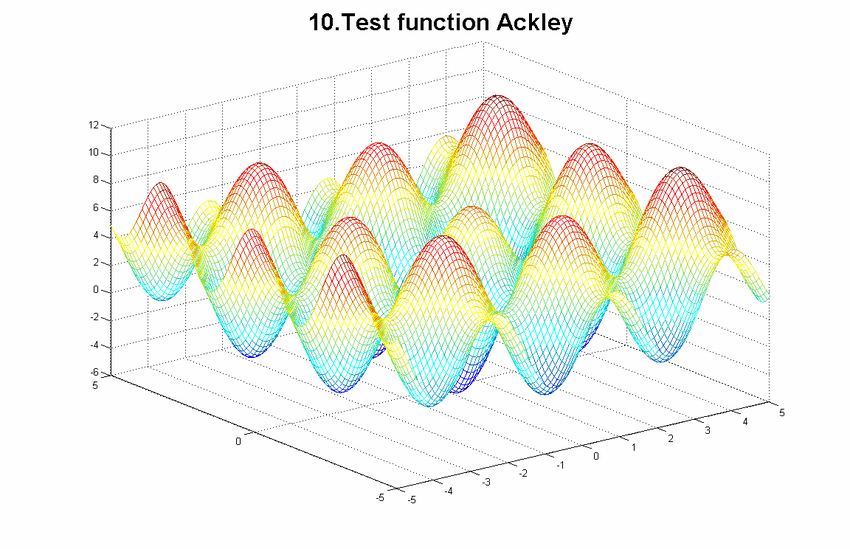

# TC2 : Optimisation

Par Dimo Brockhoff.

### Liens : 

- [Le site du professeur](http://www.cmapx.polytechnique.fr/~dimo.brockhoff/optimizationSaclay/2017/index.php)
- [Le Wiki du Group project](http://randopt.gforge.inria.fr/teaching/optimization-Saclay/groupproject2017/doku.php)

