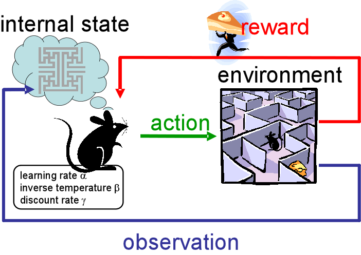

# OPT5 : Apprentissage par renforcement

Par A. Allauzen et M. Sebag

### Liens : 

- [La page du cours sur le site de l'équipe TAO](https://tao.lri.fr/courses)
- [Vidéo Richard 2016 Sutton](https://www.microsoft.com/en-us/research/video/tutorial-introduction-to-reinforcement-learning-with-function-approximation/)
- [Quelques vidéos du groupe Boston Dynamics](https://www.youtube.com/user/BostonDynamics)

