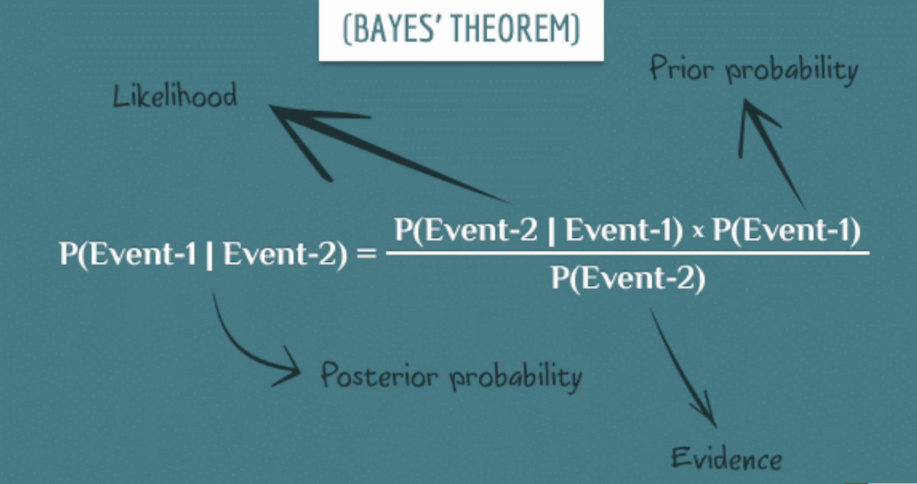

# TC4 : Algorithmes d'inférence et d'apprentissage à grande échelle

Par Alexandre Allauzen et Jean-Christophe Janodet.

## Liens :

- [Exercices de probabilités sur le site d'Alexandre Allauzen](https://allauzen.github.io/cours/Exercices_Proba/)
- [Le site de Jean-Christophe Janodet](https://www.ibisc.univ-evry.fr/~janodet/)
- [Le cloud contenant des fichiers utiles](https://ocsync.limsi.fr/index.php/s/TETPT57yxziIN8R)

