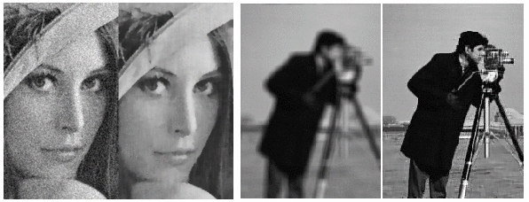

# TC5 : Traitement des images et du signal

Par Yohann Tendero.
Contact : yohann.tendero@telecom-paristech.fr

## Liens :

- [Le site de Yohann Tendero](http://perso.telecom-paristech.fr/%7Eytendero)
- [La partie AIC sur ce même site](http://perso.telecom-paristech.fr/%7Eytendero/master_aic.html)
- [Un cours de traitement du signal](http://users.polytech.unice.fr/~leroux/courssignal/courssignal.html)

